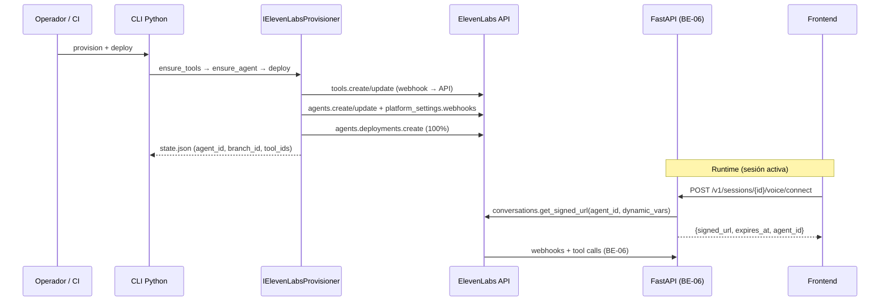

# BE-09 — ElevenLabs Agent Provision & Deploy (Python, sin UI)

**Estado:** 🚧
**Depende de:** BE-06 (webhooks + tools endpoint), BE-08 (recomendado: `/ready`, errores, observabilidad)
**Desbloquea:** conexión de voz real en frontend (plan FE futuro), staging/prod con agente privado
**PRD features:** F10.5 (nuevo), F10.6 (nuevo), F10.7 (nuevo) — **requiere PR de docs** en `PRD-backend.md` §4.10
**Stack:** backend · capas: domain + application + infrastructure + interface (CLI + REST)

## Goal

Mecanismo **100 % Python** que, a partir de configuración declarativa en el repo (`elevenlabs/agent.yaml`), **inicializa, sincroniza y despliega** el agente conversacional de ElevenLabs Agents **sin usar la UI web ni el CLI de Node**. El flujo es idempotente: re-ejecutar `provision` actualiza tools y agente; `deploy` publica la rama activa al 100 % de tráfico.

Además, expone un endpoint de runtime para que el frontend (vía backend, nunca directo a ElevenLabs) obtenga credenciales de conversación (`signed_url` o `webrtc_token`) al iniciar voz en una sesión.

> **Gap de contrato:** este plan introduce endpoints nuevos. Antes de implementar la interface REST, abrir PR `contract/elevenlabs-agent-provision` que actualice `integration_contracts.md` §5.6 y `openapi.yaml`. Sin ese PR, solo se implementa CLI + mocks.

## Relación con BE-06

| Capa | BE-06 | BE-09 |
|---|---|---|
| Receptor webhook | `POST /v1/elevenlabs/webhooks/conversation` (mock/real) | Configura ElevenLabs para **enviar** a esa URL |
| Tools | `POST /v1/elevenlabs/tools/{tool_name}` | Crea webhook tools en ElevenLabs que **invocan** esa URL |
| VOICE=mock | Simula eventos sin ElevenLabs | No aplica; provisioner usa `memory` |
| VOICE=elevenlabs | Valida firma de webhooks reales | Crea agente real + deploy |

## Arquitectura del flujo



## Configuración declarativa (fuente de verdad)

Alineado con `integration_contracts.md` §5.1. Vive en la **raíz del monorepo**:

```
elevenlabs/
├── agent.yaml                    # manifest principal
├── prompts/
│   └── agent-system.md           # system prompt (!include desde YAML)
├── tools/
│   └── agent-tools.json          # JSON Schema de tools (§4.2 / §5.2)
├── schemas/
│   └── agent-manifest.schema.json  # validación local del manifest
└── .gitignore                    # state.json, generated/
```

### `agent.yaml` (ejemplo mínimo)

```yaml
agent:
  name: superion-technician
  tags: [superion, maintenance, es]
  voice_id: ${ELEVENLABS_VOICE_ID}
  tts_model: eleven_multilingual_v2
  language: es
  asr:
    provider: scribe
    language: es
  turn_detection:
    provider: native
  barge_in: true
  first_message: "Hola, soy tu copiloto de mantenimiento. ¿En qué paso estás?"
  llm: gemini-2.0-flash          # modelo del agente ElevenLabs (no OpenRouter)
  system_prompt: !include prompts/agent-system.md
  tools: !include tools/agent-tools.json
  variables:
    plant_name: "Planta Norte"
    locale: es-MX

platform:
  webhooks:
    conversation:
      url: ${API_BASE_URL}/v1/elevenlabs/webhooks/conversation
      events:
        - conversation.started
        - utterance.final
        - tool.called
        - tool.responded
        - turn.speaker_changed
        - conversation.ended
        - error
  auth:
    enable_auth: true              # agente privado → signed_url obligatorio

deployment:
  branch: main
  traffic_percentage: 1.0
  environment: ${DEPLOY_ENV}         # dev | staging | prod
```

### Mapeo tools → webhook FastAPI

Cada entrada de `agent-tools.json` se traduce a un **webhook tool** de ElevenLabs:

```jsonc
{
  "name": "query_manual",
  "description": "Consulta el manual técnico del equipo activo.",
  "parameters": { /* JSON Schema §4.3 */ },
  "webhook": {
    "method": "POST",
    "url_template": "{API_BASE_URL}/v1/elevenlabs/tools/query_manual",
    "headers": {
      "Authorization": "Bearer {session_jwt}"  // ver nota de auth abajo
    },
    "response_timeout_secs": 25
  }
}
```

> **Nota auth tools:** ElevenLabs invoca tools con su propia autenticación. El contrato actual (§5.3) exige JWT del técnico. Opciones documentadas en el PR de contrato: (A) auth connection workspace con service token rotativo, (B) HMAC adicional en header custom validado en BE-06, (C) validación solo por `session_id` + allowlist IP ElevenLabs. **Elegir en PR contract antes de implementar.**

## Capas afectadas

### Domain
- `entities/agent_manifest.py` — `AgentManifest(name, conversation, platform, deployment)` parseado y validado
- `entities/agent_tool_spec.py` — `AgentToolSpec(name, description, parameters, webhook)`
- `entities/provision_state.py` — `ProvisionState(agent_id, branch_id, tool_ids: dict[str,str], deployed_at, environment)`
- `value_objects/provision_status.py` — `DRAFT|SYNCED|DEPLOYED|FAILED`
- `ports/elevenlabs.py` — `IElevenLabsProvisioner`, `IElevenLabsConversationClient`
- `services/manifest_validator.py` — validación pura contra schema + invariantes (tools ⊆ §4.2)

### Application
- `use_cases/elevenlabs/load_manifest.py` — lee YAML, resuelve `!include`, sustituye `${ENV}`
- `use_cases/elevenlabs/sync_tools.py` — idempotente: create-or-update cada webhook tool
- `use_cases/elevenlabs/provision_agent.py` — create-or-update agente con `conversation_config` + `platform_settings`
- `use_cases/elevenlabs/deploy_agent.py` — `deployments.create` con estrategia percentage
- `use_cases/elevenlabs/get_provision_status.py` — lee `state.json` + opcional ping a ElevenLabs
- `use_cases/voice/connect_session.py` — valida sesión activa del técnico → `get_signed_url` con `dynamic_variables` (`session_id`, `work_order_code`, `asset_tag`)
- `dto/elevenlabs.py`, `dto/voice_connect.py`

### Infrastructure
- `external/elevenlabs/manifest_loader.py` — YAML + includes (PyYAML); sin I/O de red
- `external/elevenlabs/tool_builder.py` — `AgentToolSpec` → payload API ElevenLabs (`type: webhook`)
- `external/elevenlabs/config_builder.py` — `AgentManifest` → `conversation_config` + `platform_settings`
- `external/elevenlabs/provisioner.py` — `ElevenLabsSdkProvisioner` con SDK oficial `elevenlabs` (`AsyncElevenLabs`)
- `external/elevenlabs/conversation_client.py` — `get_signed_url`, `get_webrtc_token`
- `external/elevenlabs/in_memory_provisioner.py` — simula create/update/deploy; persiste en memoria + escribe `state.json` de prueba
- `external/elevenlabs/state_store.py` — lectura/escritura atómica de `elevenlabs/state.json` (gitignored)
- `factories.py` — `get_elevenlabs_provisioner()`, `get_elevenlabs_conversation_client()`

### Interface
- `cli/elevenlabs.py` — entrypoint Python (argparse):
  - `provision [--dry-run] [--manifest path]`
  - `deploy [--branch main] [--traffic 1.0]`
  - `status [--json]`
  - `validate-manifest`
- `http/routers/voice.py` — `POST /v1/sessions/{id}/voice/connect` (requiere PR contract)
- `http/routers/admin/elevenlabs.py` — `GET /v1/admin/elevenlabs/agent/status` (supervisor/rag_admin; opcional v1)
- `http/exception_handlers.py` — `ELEVENLABS_UNAVAILABLE`, `AGENT_NOT_PROVISIONED`, `VOICE_CONNECT_FAILED`

## Switch vía .env

```bash
# Provisioner (ops / CI)
ELEVENLABS_PROVISIONER=memory|api          # default: memory
ELEVENLABS_AGENT_MANIFEST=elevenlabs/agent.yaml
ELEVENLABS_STATE_FILE=elevenlabs/state.json
API_BASE_URL=http://localhost:8000         # sustitución en manifest
DEPLOY_ENV=dev                             # dev | staging | prod

# Runtime (existentes BE-06 + nuevos)
VOICE=mock|elevenlabs                      # elevenlabs activa conversation client real
ELEVENLABS_API_KEY=                        # obligatorio si provisioner=api o VOICE=elevenlabs
ELEVENLABS_AGENT_ID=                       # se escribe tras provision; override manual permitido
ELEVENLABS_VOICE_ID=                       # voz TTS del agente
ELEVENLABS_WEBHOOK_SECRET=change-me
ELEVENLABS_CONNECT_MODE=signed_url|webrtc  # default: signed_url
```

### Dependencia Python (solo cuando `ELEVENLABS_PROVISIONER=api`)

Añadir optional extra en `pyproject.toml`:

```toml
[project.optional-dependencies]
elevenlabs = [
    "elevenlabs>=1.50.0",
    "pyyaml>=6.0.2",
]
```

Instalación: `pip install -e ".[dev,elevenlabs]"`

> **Prohibido** usar `@elevenlabs/cli` (npm) ni UI web para provisionar. El SDK/REST vía Python es el único camino soportado.

## PR de contrato requerido (antes de REST)

Añadir a `integration_contracts.md` §5.6:

#### `POST /v1/sessions/{id}/voice/connect`

Request: `{}` (vacío; `session_id` en path)

Response 200:
```jsonc
{
  "agent_id": "agent_…",
  "connect_mode": "signed_url",
  "signed_url": "wss://…",
  "expires_at": "2026-07-04T20:45:00Z",
  "dynamic_variables": {
    "session_id": "uuid",
    "work_order_code": "OT-1234",
    "asset_tag": "COMP-01"
  }
}
```

Errores: `SESSION_NOT_FOUND`, `SESSION_NOT_ACTIVE`, `AGENT_NOT_PROVISIONED`, `ELEVENLABS_UNAVAILABLE`.

#### `GET /v1/admin/elevenlabs/agent/status` (opcional v1)

Response 200:
```jsonc
{
  "provisioner": "api",
  "agent_id": "agent_…",
  "branch_id": "agtbrch_…",
  "deployed_at": "2026-07-04T18:00:00Z",
  "environment": "dev",
  "tools_synced": 11,
  "status": "deployed"
}
```

## Tests que se escriben PRIMERO

### Unit
1. `tests/unit/domain/test_agent_manifest.py` — invariantes: language=es, tools ⊆ catálogo §4.2
2. `tests/unit/domain/test_manifest_validator.py` — rechaza tool desconocida, URL sin `API_BASE_URL`
3. `tests/unit/application/test_load_manifest.py` — `!include`, sustitución `${ENV}`
4. `tests/unit/infrastructure/test_tool_builder.py` — JSON Schema → payload webhook ElevenLabs
5. `tests/unit/infrastructure/test_config_builder.py` — `agent.yaml` → `conversation_config` esperado
6. `tests/unit/application/test_provision_agent.py` — idempotente: segundo run → update, no duplicar
7. `tests/unit/application/test_deploy_agent.py` — traffic 100 %, branch correcta
8. `tests/unit/application/test_connect_session.py` — sesión ajena → 403, no activa → 409

### Integration
9. `tests/integration/test_elevenlabs_cli.py` — `provision --dry-run` imprime plan sin red
10. `tests/integration/test_in_memory_provisioner.py` — ciclo completo provision → deploy → state.json
11. `tests/integration/test_voice_connect_router.py` — mock client devuelve signed_url (tras PR contract)
12. `tests/integration/test_manifest_on_disk.py` — carga `elevenlabs/agent.yaml` real del repo

### Live (opcional, no bloqueante CI)
13. `tests/live/test_elevenlabs_provision_api.py` — `@pytest.mark.live`; skip sin `ELEVENLABS_API_KEY`; crea agente en workspace de prueba y lo elimina en teardown

### E2E
14. `tests/e2e/test_elevenlabs_provision_e2e.py`:
    - `ELEVENLABS_PROVISIONER=memory`
    - Ejecutar CLI `provision` + `deploy`
    - Verificar `state.json` con `agent_id`
    - `POST /v1/sessions/{id}/voice/connect` → 200 + `signed_url` mock
    - Simular webhook `conversation.started` firmado (BE-06) con `agent_id` del state
    - Verificar cadena WS `assistant.answering` → `tool.called` → `assistant.answered`

## Implementación mínima para verde

### 1. Manifest loader
- PyYAML con constructor custom para `!include` (ruta relativa al manifest).
- Sustitución `${VAR}` desde `os.environ` / `settings`; falla si falta variable requerida.

### 2. InMemoryElevenLabsProvisioner
```python
class InMemoryElevenLabsProvisioner:
    async def ensure_tools(self, tools: list[AgentToolSpec]) -> dict[str, str]:
        # devuelve tool_name → synthetic tool_id

    async def ensure_agent(self, manifest: AgentManifest, tool_ids: dict[str, str]) -> str:
        # devuelve agent_id sintético; guarda config en memoria

    async def deploy(self, agent_id: str, branch: str, traffic: float) -> ProvisionState:
        # marca DEPLOYED; escribe state.json
```

### 3. ElevenLabsSdkProvisioner (real)
Secuencia idempotente:
```python
# 1. Tools
for spec in manifest.tools:
    existing = await self._find_tool_by_name(spec.name)
    payload = build_webhook_tool(spec, api_base_url=settings.API_BASE_URL)
    tool_id = existing.id if existing else (await client.conversational_ai.tools.create(**payload)).id

# 2. Agent
conversation_config = build_conversation_config(manifest, tool_ids)
platform_settings = build_platform_settings(manifest)
agent_id = settings.ELEVENLABS_AGENT_ID or state.agent_id
if agent_id:
    await client.conversational_ai.agents.update(agent_id=agent_id, ...)
else:
    resp = await client.conversational_ai.agents.create(...)
    agent_id = resp.agent_id

# 3. Deploy
await client.conversational_ai.agents.deployments.create(
    agent_id=agent_id,
    deployment_request=AgentDeploymentRequest(...),
)
```

### 4. CLI Python
```bash
cd backend
python -m interface.cli.elevenlabs provision --dry-run
python -m interface.cli.elevenlabs provision
python -m interface.cli.elevenlabs deploy
python -m interface.cli.elevenlabs status --json
```

Exit codes: `0` ok, `1` error validación, `2` error API ElevenLabs, `3` agent no provisionado.

### 5. Connect session (mock)
```python
class InMemoryConversationClient:
    async def get_signed_url(self, agent_id: str, *, session_id: str, **vars) -> VoiceConnectResult:
        return VoiceConnectResult(
            agent_id=agent_id,
            connect_mode="signed_url",
            signed_url=f"wss://mock.elevenlabs.test/{agent_id}/{session_id}",
            expires_at=clock.now() + timedelta(minutes=15),
        )
```

## Archivos a crear/modificar

```
elevenlabs/agent.yaml
elevenlabs/prompts/agent-system.md
elevenlabs/tools/agent-tools.json
elevenlabs/schemas/agent-manifest.schema.json
elevenlabs/.gitignore

backend/pyproject.toml                                    # MODIFY — extra [elevenlabs]
backend/.env.example                                      # MODIFY — vars nuevas
backend/src/domain/entities/agent_manifest.py
backend/src/domain/entities/agent_tool_spec.py
backend/src/domain/entities/provision_state.py
backend/src/domain/value_objects/provision_status.py
backend/src/domain/ports/elevenlabs.py
backend/src/domain/services/manifest_validator.py
backend/src/application/use_cases/elevenlabs/load_manifest.py
backend/src/application/use_cases/elevenlabs/sync_tools.py
backend/src/application/use_cases/elevenlabs/provision_agent.py
backend/src/application/use_cases/elevenlabs/deploy_agent.py
backend/src/application/use_cases/elevenlabs/get_provision_status.py
backend/src/application/use_cases/voice/connect_session.py
backend/src/application/dto/elevenlabs.py
backend/src/application/dto/voice_connect.py
backend/src/infrastructure/external/elevenlabs/manifest_loader.py
backend/src/infrastructure/external/elevenlabs/tool_builder.py
backend/src/infrastructure/external/elevenlabs/config_builder.py
backend/src/infrastructure/external/elevenlabs/provisioner.py
backend/src/infrastructure/external/elevenlabs/conversation_client.py
backend/src/infrastructure/external/elevenlabs/in_memory_provisioner.py
backend/src/infrastructure/external/elevenlabs/state_store.py
backend/src/infrastructure/factories.py                   # MODIFY
backend/src/infrastructure/config.py                      # MODIFY
backend/src/interface/cli/elevenlabs.py
backend/src/interface/http/routers/voice.py
backend/src/interface/http/routers/admin/elevenlabs.py    # opcional v1
backend/src/interface/http/exception_handlers.py          # MODIFY
backend/src/application/use_cases/readiness.py            # MODIFY — AGENT_NOT_PROVISIONED
```

## E2E test scenario (operador)

```bash
# 1. Backend arriba con BE-06 verde
cd backend && uvicorn main:app --reload

# 2. Provisionar agente (memoria para CI; api para staging)
ELEVENLABS_PROVISIONER=memory API_BASE_URL=http://localhost:8000 \
  python -m interface.cli.elevenlabs provision

ELEVENLABS_PROVISIONER=memory \
  python -m interface.cli.elevenlabs deploy

# 3. Verificar estado
python -m interface.cli.elevenlabs status --json
# → {"status":"deployed","agent_id":"agent_mock_…","tools_synced":11}

# 4. Conectar voz en sesión activa
curl -s -X POST "$API/v1/sessions/$SID/voice/connect" \
  -H "Authorization: Bearer $TOKEN" | jq .
# → signed_url + expires_at

# 5. (Con provisioner=api y API key real) Abrir conversación con SDK solo para smoke:
# python scripts/smoke_elevenlabs_conversation.py --signed-url "$SIGNED_URL"
```

### Staging con API real

```bash
export ELEVENLABS_PROVISIONER=api
export ELEVENLABS_API_KEY=sk_…
export API_BASE_URL=https://api.staging.superion.example
export DEPLOY_ENV=staging
python -m interface.cli.elevenlabs provision
python -m interface.cli.elevenlabs deploy
# Copiar agent_id a secret manager → ELEVENLABS_AGENT_ID en runtime
```

## Definition of Done

- [ ] PR `contract/elevenlabs-agent-provision` mergeado (o explícitamente aplazado: solo CLI sin REST)
- [ ] PR `docs/be-09-prd-features` con F10.5–F10.7 en `PRD-backend.md`
- [ ] `elevenlabs/agent.yaml` + tools + prompt commiteados; `state.json` gitignored
- [ ] `pytest -q` pasa 100 % (live tests excluidos en CI con `-m "not live"`)
- [ ] CLI `provision` idempotente en modo `memory` y `api`
- [ ] CLI `deploy` publica al porcentaje configurado
- [ ] `InMemoryElevenLabsProvisioner` usable sin API key ni red
- [ ] `ElevenLabsSdkProvisioner` crea/actualiza tools, agente y deployment vía SDK Python
- [x] `POST /v1/sessions/{id}/voice/connect` devuelve `signed_url` sin exponer `ELEVENLABS_API_KEY`
- [x] `GET /v1/admin/elevenlabs/agent/status` (supervisor/rag_admin)
- [ ] `/ready` reporta `elevenlabs_agent: ok|not_configured` cuando `VOICE=elevenlabs`
- [ ] `.env.example` documentado
- [ ] Sin uso de UI web ni `@elevenlabs/cli` npm en scripts ni docs operativas
- [ ] Ruff + mypy strict en domain/application

## Notas

- **Idempotencia:** `state.json` guarda IDs remotos; un segundo `provision` hace `update`, no `create` duplicado. Si el agente fue borrado en ElevenLabs, `provision --force-recreate` (flag opcional) ignora state y crea uno nuevo.
- **Secretos:** nunca commitear `ELEVENLABS_API_KEY` ni `state.json` con IDs de prod. En CI usar `memory` exclusivamente.
- **Auth de tools:** resolver en PR contract (ver nota en §Mapeo tools). BE-06 puede necesitar un ajuste menor tras la decisión.
- **LangGraph real:** BE-09 no sustituye `MockLangGraphClient`; solo cablea ElevenLabs → FastAPI. LangGraph real es plan separado (post BE-08).
- **Rollback:** `deploy` con `traffic_percentage: 0` sobre rama anterior o restaurar `state.json` previo + `provision`. Documentar en `backend/RUNBOOK.md`.
- **Siguiente plan sugerido:** FE — conexión WebRTC/WebSocket con `signed_url` del endpoint `voice/connect`.

## Features PRD propuestas (para PR docs)

| ID | Descripción |
|---|---|
| **F10.5** | Provisionamiento declarativo del agente ElevenLabs desde `elevenlabs/agent.yaml` vía Python |
| **F10.6** | Deploy automatizado (API `agents.deployments.create`) sin UI |
| **F10.7** | Endpoint `voice/connect` que emite `signed_url`/`webrtc_token` para sesión activa |
